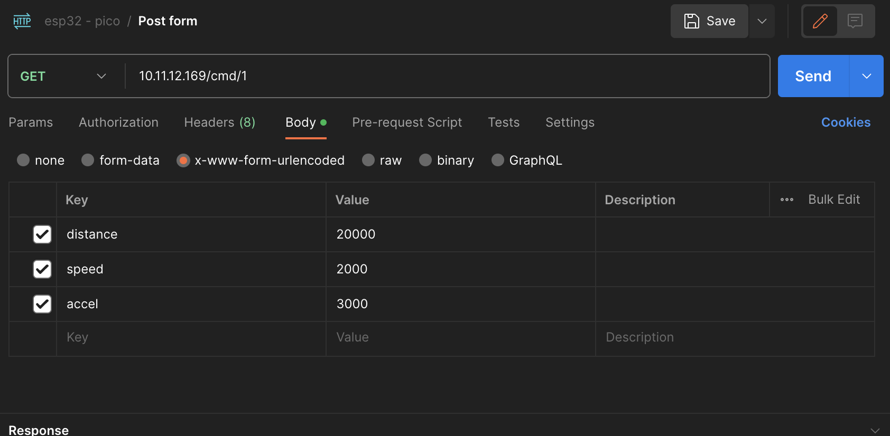

## 2 Bipolar steppers

In this project we'll be controlling two bipolar stepper motors on an ESP32-C3, over HTTP + Wifi.

Visit the video here: [https://youtu.be/v59J8jRdOIY](https://youtu.be/v59J8jRdOIY)

### Challenges
None of these parts are difficult by themselves:
- Creating an HTTP endpoint is a commodity for decades.
- Controlling bipolar motors is straightforward: Setting one pin high or low will control the direction, and by toggling another pin we will move the motor

Combining all of it it gets trickier, and we need to deal with some pretty time critical code:

Both motors need hundreds or thousends of pulses per second, accelerating and decelerating smoothly, so it is really time critical that the processor does not get blocked.

Both motors can move at the same time. While the motor is running, the HTTP endpoint must be able to receive more commands. Motor commands can be queued. Per motor.

Also the HTTP endpoint needs to get attention: Accept sockets, parse headers, send responses. To do that, we'll be using [picoserve](https://github.com/sammhicks/picoserve) a cool but very early HTTP server, inspired by Axum. This is the only no_std HTTP server on top of Embassy that I know of, other examples manually parse HTTP.

Finally the network itself needs attention, to respond to network packages and waking up the right futures.

We only have one core, about 400Kb of RAM and we don't have pre-emptive OS threads (or an OS for that matter), so we will have to do all of this using our async runtime.

We will be using [Embassy](https://embassy.dev), an async runtime specifically geared towards constrained devices.

To do the work, we will create a bunch of permanent 'tasks' that will run forever, but will yield very frequenly.

We will be communicating via Channels. Each motor gets the receiver end, and the HTTP service gets all the senders.

 ## Running (and building)

Make sure your SSID and PASSWORD environment variables point to a local Wifi AP. Note that the micro controller has no notion of environment variables, so the build will hard code the values in the binary.

I.e., if you change them, you will need to rebuild and re-flash.

Plug in your board in a USB port, then:
 ```shell
 cargo espflash flash --release --monitor
 ```
Wait until compilation and flashing is complete, and monitor the output.
The output will mention the IP it got assigned.

Use that IP from a UI or other tool, like Postman:


... and use it to post movement commands. \<ip\>/cmd/1 for motor 1, \<ip>\>/cmd/2 for motor 2.

Try to queue up multiple commands.